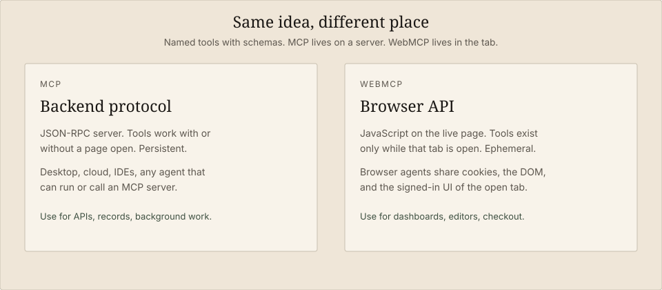
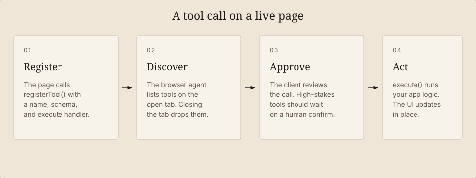

<style>
article .single_hero_round { max-height: none; object-fit: contain; height: auto; background: #E6D9C6; }
.diagram-wrap { margin: 1.75rem 0 2.25rem; }
.diagram-wrap img { width: 100%; height: auto; border-radius: 4px; }
.diagram-wrap figcaption { text-align: center; font-size: 0.9rem; opacity: 0.75; margin-top: 0.6rem; }
.callout { border-left: 3px solid #3D4F40; padding: 0.9rem 1rem; margin: 1.4rem 0; background: color-mix(in srgb, currentColor 6%, transparent); border-radius: 0 4px 4px 0; }
</style>

**WebMCP** is a proposed web API that lets a page expose named, schema-backed tools to an AI agent running in the browser. The agent does not have to guess which button to click. It calls `filter_results` or `leave_comment` the way a coding agent calls `read_file`.

That is the whole pitch. It is also where the confusion starts. WebMCP is **not** Model Context Protocol (MCP). It is not a W3C Recommendation. ChatGPT already has a productized subset of it. Claude, as of this writing, does not discover those tools natively in Chrome.

This guide covers the draft as it stands in September 2026: what the API does, how it differs from MCP, how to register a tool, how to use it in ChatGPT, and what actually works with Claude.

<div class="callout">

**In one sentence:** WebMCP is *MCP-inspired tools that live in the open tab* — JavaScript functions with descriptions and JSON Schema, bound to the user’s live session, gone when the tab closes.

</div>

<figure class="diagram-wrap">
  
  <figcaption>Figure 1. Same philosophy — named tools, schemas, predictable calls. Different home: a server versus the page you already have open.</figcaption>
</figure>

## What is WebMCP?

The [WebMCP specification](https://webmachinelearning.github.io/webmcp/) is a **Draft Community Group Report** from the W3C Web Machine Learning Community Group. Editors include engineers at Microsoft and Google. The spec is explicit about status: it is **not** a W3C Standard and it is **not** on the W3C Standards Track.

Chrome documents it the same way: a [proposed standard](https://developer.chrome.com/docs/ai/webmcp) for exposing structured tools to browser agents, with an origin trial from Chrome 149 and a local flag at `chrome://flags/#enable-webmcp-testing`.

A page that implements WebMCP registers tools on `document.modelContext`. Each tool has:

- a **name** (ASCII, 1–128 characters)
- a **description** the model can read
- an **input schema** (JSON Schema)
- an **execute** handler that runs in page JavaScript
- optional **annotations** (`readOnlyHint`, `untrustedContentHint`, `consequentialHint`)

Chrome’s developer guide also describes a **declarative** path: annotate an HTML form and let the browser synthesize a tool. That path is real in Chrome’s preview. ChatGPT’s current Site tools implementation **does not** pick it up.

### Why it exists

Browser agents without WebMCP **actuate**: they screenshot, parse the DOM, click, and type. Every step is an interpretation of UI that was designed for people. Layout changes, icon-only buttons, and custom date pickers all become failure modes.

WebMCP asks the site to **declare purpose**. `checkout` is checkout. `set_date_range` is a date range. The handler reuses the same application logic the human interface already calls, so a redesign of the CSS does not break the agent the way a moved button does.

Chrome’s term for the old path is *actuation*. WebMCP is the replacement for that guesswork on pages that opt in.

### Two APIs

| API | How you define a tool | Where it works today |
| --- | --- | --- |
| **Imperative** | `document.modelContext.registerTool({ name, description, inputSchema, execute })` | Chrome origin trial / flag; ChatGPT Site tools (top-level page only) |
| **Declarative** | HTML form attributes such as tool name and description | Chrome preview; **not** ChatGPT Site tools |

If you want ChatGPT to see the tool, register it in JavaScript on the **top-level** page. Feature-detect first. Preserve the ordinary UI for browsers that have no `modelContext`.

## WebMCP is not MCP

People hear “WebMCP” and assume it is MCP running in the browser. Chrome’s own [comparison](https://developer.chrome.com/blog/webmcp-mcp-usage) exists because that question is the default.

**MCP** is a JSON-RPC protocol. A server exposes tools, resources, and prompts to any client that can speak MCP: Claude Desktop, Claude Code, ChatGPT connectors, IDEs. The tools work whether or not a webpage is open. Lifecycle is persistent.

**WebMCP** is a browser API. The page *is* the tool host. There is no MCP wire protocol on the tab. Chrome describes it as MCP-*inspired*, purpose-built for the browser, and missing server-side concepts such as resources. Lifecycle is ephemeral: navigate away or close the tab, and the tools are gone.

| | MCP | WebMCP |
| --- | --- | --- |
| What it is | Protocol + server | Browser API on `document.modelContext` |
| Where tools run | Your backend or local process | The live page’s JavaScript |
| Availability | Anywhere the client is configured | Only while that tab is open |
| Session | Whatever the server authenticates | The user’s cookies, DOM, and signed-in UI |
| Discovery | Client registers the server | Agent visits the page |
| Best for | Records, search, background jobs | Editors, dashboards, checkout, in-page workflows |

You do not choose one. Chrome’s guidance is to use **both**: MCP for core business logic that should work headless, WebMCP for the last mile on the UI the user is looking at.

<figure class="diagram-wrap">
  
  <figcaption>Figure 2. The page owns the tool. The agent proposes a call. The browser and the user stay in the loop.</figcaption>
</figure>

## Register a tool

Start with an operation the app already supports. A dashboard that already has a date-range control is a better first tool than a new “do everything” gateway.

```javascript
if (typeof document.modelContext?.registerTool === "function") {
  await document.modelContext.registerTool({
    name: "set_date_range",
    description:
      "Set the dashboard date range and return the updated summary metrics.",
    inputSchema: {
      type: "object",
      properties: {
        start: { type: "string", description: "Inclusive start date, YYYY-MM-DD." },
        end: { type: "string", description: "Inclusive end date, YYYY-MM-DD." },
      },
      required: ["start", "end"],
      additionalProperties: false,
    },
    annotations: { readOnlyHint: false, consequentialHint: false },
    execute: async ({ start, end }) => {
      const summary = await dashboard.setRange({ start, end });
      return summary;
    },
  });
}
```

That snippet matches the shape OpenAI documents for Site tools and the [imperative API](https://developer.chrome.com/docs/ai/webmcp/imperative-api) Chrome documents for the origin trial.

A few rules that actually matter:

- **Feature-detect.** `document.modelContext` is not on every browser.
- **Reuse existing auth and validation.** The tool is not a backdoor. If a human cannot do it in this session, the agent should not be able to either.
- **Keep inputs narrow.** Accept `YYYY-MM-DD`, not “the last two sprints minus bank holidays.” Do the calendar math in your code.
- **Return something the agent can verify.** Counts, ids, a short status — enough that the next step is grounded in the result, not in the model’s story about the result.
- **Mark side effects.** `readOnlyHint: true` for lookups. `consequentialHint: true` for bookings, payments, deletes. Treat those hints as hints; enforce the real checks in application code and in the client’s confirmation UI.
- **Register when the tool is usable, unregister when it is not.** Chrome lets you pass an `AbortSignal` into `registerTool` and abort it when a component unmounts. SPA routes that leave a stale tool list will confuse every agent that caches the surface.

Older demos and some testing APIs still talk about `navigator.modelContext` or `navigator.modelContextTesting`. The specification and ChatGPT’s docs use **`document.modelContext`**. If you copy a 2026-era snippet, check which object it registers on.

Chrome also ships `getTools()`, `executeTool()`, and a `toolchange` event so a page-hosted agent can list and call tools. You need those if you are building an in-page assistant. You do not need them for ChatGPT Site tools: the desktop browser discovers what you registered.

## How to use WebMCP with ChatGPT

OpenAI’s product name is **Site tools**. The docs call it ChatGPT’s implementation of the proposed WebMCP standard. There is no separate connector to install.

Official sources: [Site tools on ChatGPT Learn](https://learn.chatgpt.com/docs/webmcp) and [Using site tools in the ChatGPT desktop app](https://help.openai.com/en/articles/20001423-using-site-tools-in-the-chatgpt-desktop-app).

### What you need

- The **ChatGPT desktop app**, updated.
- The app’s **built-in browser**, not Chrome and not the ChatGPT browser extension.
- **ChatGPT Work** or **Codex** as the agent that will use the tools.
- **GPT-5.6 Sol** or **GPT-5.6 Terra**. OpenAI currently has WebMCP **disabled on GPT-5.6 Luna**.
- A page that actually registers tools.
- An account that is in the rollout. Site tools are **not** available in Enterprise or Edu workspaces.

Chrome login cookies do not carry over. Sign in on the site *inside* the built-in browser.

### As a user

1. Open the built-in browser from the desktop app toolbar.
2. Go to the page you want help with and sign in there if the task needs a session.
3. Look at the address bar. If the page offers Site tools, OpenAI shows an indicator (an arrow in current help-center copy). Open it and inspect **Available site tools**.
4. Ask for the outcome: “Find the Q3 section and leave a comment asking for the source of the 12% figure.” Do not try to guess the internal tool name.
5. Review the website-access prompt. Check the site, the requested access, and the intended action before you allow it.
6. Watch the live page. The point of WebMCP is that you and the agent share the same UI. Confirm the change there, not only in the chat transcript.
7. If recent activity is listed, open it to see which tools ran.

You can turn the feature off under **Settings → Browser → Permissions → Enable site tools**.

OpenAI dogfoods this on its own docs. ChatGPT Learn and OpenAI Developers expose tools such as `search_openai_docs`, `lookup_page`, `lookup_context`, `navigate_to_page`, and `generate_custom_guide`. That is a good first page to try if you want to see Site tools without writing any code.

### As a developer shipping a site ChatGPT can use

Register tools with `document.modelContext.registerTool` in a top-level module, as in the example above.

ChatGPT’s built-in browser currently **does not** support:

- the **declarative** HTML-form API
- tools registered **inside iframes**, same-origin or not

If no suitable tool exists, Work or Codex may still use ordinary browser actuation. Those clicks are not WebMCP calls, and they are the fragile path you were trying to avoid.

You can ask Codex to add WebMCP to an app you already have open: describe the in-page actions an agent should be allowed to take, and tell it to reuse existing application functions and permissions.

### Security, in ChatGPT’s words and in practice

OpenAI treats website-provided tool definitions and results as **untrusted content**. A tool named `read_only_summary` is not proof that it only reads. Site instructions do not authorize the agent to leak unrelated data.

The built-in browser reviews each invocation before it runs. Consequential actions — messages, purchases, deletes, permission changes — still go through normal confirmation policy. The client ties the call to the originating page and registration.

Those checks reduce risk. They do not make a random webpage trustworthy. Read the result on the page before you rely on it.

## How to use WebMCP with Claude

This is the part most roundups get wrong.

**Claude does not have ChatGPT-style Site tools.** There is no documented Anthropic product that auto-discovers `document.modelContext` when you open a tab. [Claude Code issue #76809](https://github.com/anthropics/claude-code/issues/76809) (open as of September 2026) asks for WebMCP discovery in **Claude in Chrome**. The current behavior reported there: the extension surfaces nothing from the page’s model context. If you *instruct* Claude to evaluate the JS API, invocation can work. Discovery does not. It falls back to screenshot and DOM loops even when the page published a clean tool list.

So you pick a path that matches how you actually run Claude.

### Path 1: Give Claude MCP, not WebMCP (usually the right one)

If you own the product, expose the same capabilities as a normal [MCP](https://modelcontextprotocol.io/) server and connect it in **Claude Desktop** or **Claude Code**. That is the persistent, headless, any-client version of the work. WebMCP stays on the website for browser agents. MCP stays on the server for Claude.

Claude Desktop config (`~/Library/Application Support/Claude/claude_desktop_config.json` on macOS, or the Windows equivalent):

```json
{
  "mcpServers": {
    "acme-dashboard": {
      "command": "npx",
      "args": ["-y", "acme-dashboard-mcp"]
    }
  }
}
```

For Claude Code, the same server goes in `.mcp.json` at the project or user level.

This is not a workaround. It is the split Chrome recommends: MCP for core logic, WebMCP for the live UI.

### Path 2: Claude in Chrome, with an explicit instruction

If the user already has the page open and you cannot ship an MCP server, tell Claude to use the page API instead of clicking:

> On this tab, if `document.modelContext` exists, call `getTools()` (or `listTools()` on older testing surfaces), then `executeTool` / `registerTool`’s execute path for the user’s request. Prefer those structured tools over clicking the DOM. Re-list tools after each call; the set changes with page state.

That prompt is a crutch. You are compensating for missing discovery. It can still beat a 40-step click tour on a dense SPA.

Do not scrape a hidden “tool catalog” into the accessibility tree so the extension can walk it. People have shipped that. Screen readers then read the catalog. Native discovery exists specifically so you can delete that hack.

### Path 3: Claude Desktop or Claude Code driving a WebMCP-capable Chrome

If you need Claude to *be* the browser agent against a WebMCP page, connect it to Chrome through [Chrome DevTools MCP](https://github.com/ChromeDevTools/chrome-devtools-mcp) and prefer WebMCP calls over actuation.

Local development:

1. Enable `chrome://flags/#enable-webmcp-testing` and relaunch Chrome.
2. Open the page in that Chrome.
3. Point Claude at Chrome DevTools MCP so it can `navigate_page` and `evaluate_script`.

Then the agent’s first move on every load should be: list tools, read schemas, call tools, list again. Cloudflare’s [Browser Run WebMCP notes](https://developers.cloudflare.com/browser-run/features/webmcp/) spell that workflow out for lab sessions (Chrome beta with WebMCP APIs). The listing call they show on the testing surface is:

```javascript
await navigator.modelContextTesting.listTools();
```

and execution:

```javascript
await navigator.modelContextTesting.executeTool(
  "search_location",
  JSON.stringify({ query: "Paris" })
);
```

On a page that follows the spec, prefer `document.modelContext.getTools()` and `document.modelContext.executeTool(tool, args)`. Probe both if you are on an origin-trial build; the testing names moved while the draft was in flight.

Human-in-the-loop still applies. A `complete_booking` tool that waits for **Confirm** on the visible page is doing WebMCP correctly. Keep a live view of the browser so you can press the button the tool is blocked on.

### What not to expect from Claude today

- Auto Site-tools discovery in the Claude Chrome extension
- Declarative form tools showing up as first-class Claude tools
- A stable, official Anthropic “WebMCP connector”

When discovery lands in Claude in Chrome, the site-side work you already did — `registerTool`, tight schemas, register/unregister with route changes — is what that client will consume. You are not waiting on a different API.

## Design the tools like a contract

Chrome’s [best practices](https://developer.chrome.com/docs/ai/webmcp/best-practices) read like API design, because that is what this is.

- One tool, one job. Overlapping tools make the model hesitate.
- Names should say whether the call **does the thing** (`create_event`) or **opens the flow** (`start_event_creation`).
- Describe what the tool does and when to use it. Prefer positive language. “Don’t use this for weather” is a bad description; a weather tool with a clear scope is the fix.
- Accept messy human input in parameters (`"11:00 to 15:00"`) and parse it in code.
- Validate strictly in the handler. Schema is advisory. Return errors the model can retry from.
- After a mutation, update the UI before you resolve the promise, so the agent’s next observation matches the world.

Treat tool output as untrusted if it includes user-generated or third-party text (`untrustedContentHint: true`). Indirect prompt injection through a “summary” tool is the obvious attack.

## When WebMCP is the wrong tool

Skip it when:

- The work should run **without a tab** (reports, overnight sync, CI). That is MCP.
- The page is a static article with nothing to *do*.
- You were about to wrap the entire app in one `do_anything` tool. That recreates the click-guessing problem inside a function name.
- You need a finished, cross-browser standard. You do not have one yet. Ship behind feature detection.

Headless automation is a poor fit for the design intent. Chrome says the API is for local browser workflows with a human in the loop. Cloudflare’s lab path exists for experiments; it is not the product model.

## Try it

- Spec: [webmachinelearning.github.io/webmcp](https://webmachinelearning.github.io/webmcp/)
- Chrome: [WebMCP](https://developer.chrome.com/docs/ai/webmcp), [imperative API](https://developer.chrome.com/docs/ai/webmcp/imperative-api), [when to use WebMCP and MCP](https://developer.chrome.com/blog/webmcp-mcp-usage)
- ChatGPT: [Site tools](https://learn.chatgpt.com/docs/webmcp)
- Demos: Chrome’s [zaMaker, travel, and bistro examples](https://developer.chrome.com/docs/ai/webmcp#demo)
- Local Chrome: `chrome://flags/#enable-webmcp-testing`, then the [Model Context Tool Inspector](https://developer.chrome.com/docs/ai/webmcp) extension
- Claude in Chrome discovery: [issue #76809](https://github.com/anthropics/claude-code/issues/76809)

The standard is still a draft. The useful part is already concrete: if an agent is going to work *in your UI*, stop making it reverse-engineer the UI. Give it the same functions your buttons already call.

<script type="application/ld+json">
{
  "@context": "https://schema.org",
  "@type": "FAQPage",
  "mainEntity": [
    {
      "@type": "Question",
      "name": "What is WebMCP?",
      "acceptedAnswer": {
        "@type": "Answer",
        "text": "WebMCP is a proposed browser API, published as a W3C Community Group draft, that lets a webpage register JavaScript tools with names, descriptions, and JSON Schema so an AI agent in the browser can call them instead of clicking the UI."
      }
    },
    {
      "@type": "Question",
      "name": "Is WebMCP the same as MCP?",
      "acceptedAnswer": {
        "@type": "Answer",
        "text": "No. MCP is a JSON-RPC protocol for persistent servers. WebMCP is a tab-bound browser API. They share the idea of named tools with schemas, but they are not wire-compatible and they solve different availability problems."
      }
    },
    {
      "@type": "Question",
      "name": "How do I use WebMCP with ChatGPT?",
      "acceptedAnswer": {
        "@type": "Answer",
        "text": "Use the ChatGPT desktop app’s built-in browser with ChatGPT Work or Codex, and select GPT-5.6 Sol or Terra. Open a page that registers tools, inspect Site tools in the address bar, ask for the outcome, and approve the website-access prompt. Enterprise and Edu workspaces do not have Site tools."
      }
    },
    {
      "@type": "Question",
      "name": "Does Claude support WebMCP?",
      "acceptedAnswer": {
        "@type": "Answer",
        "text": "Not as a native Site-tools equivalent. Claude in Chrome does not auto-discover page tools as of September 2026. Use a normal MCP server for the same capabilities, instruct Claude to call document.modelContext on the open tab, or drive a WebMCP-capable Chrome via Chrome DevTools MCP."
      }
    }
  ]
}
</script>
