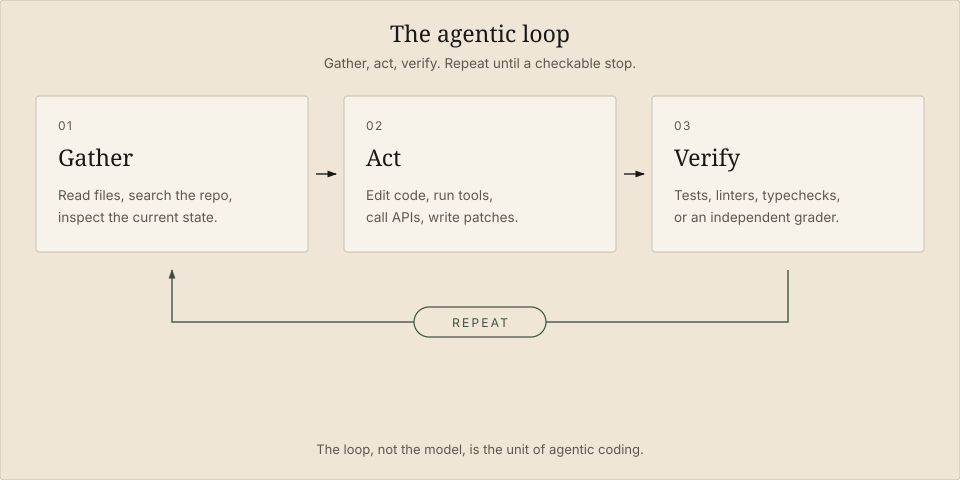
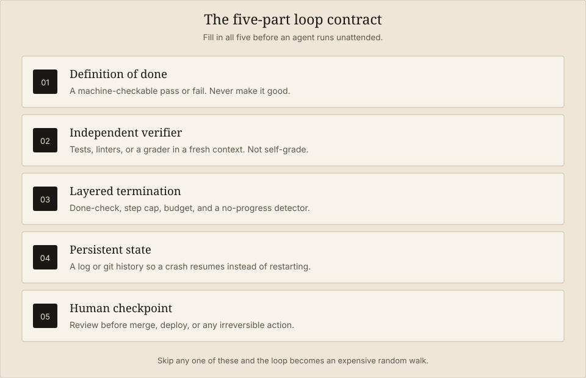
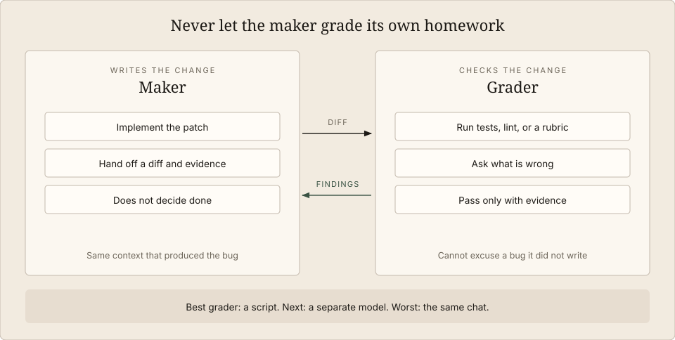
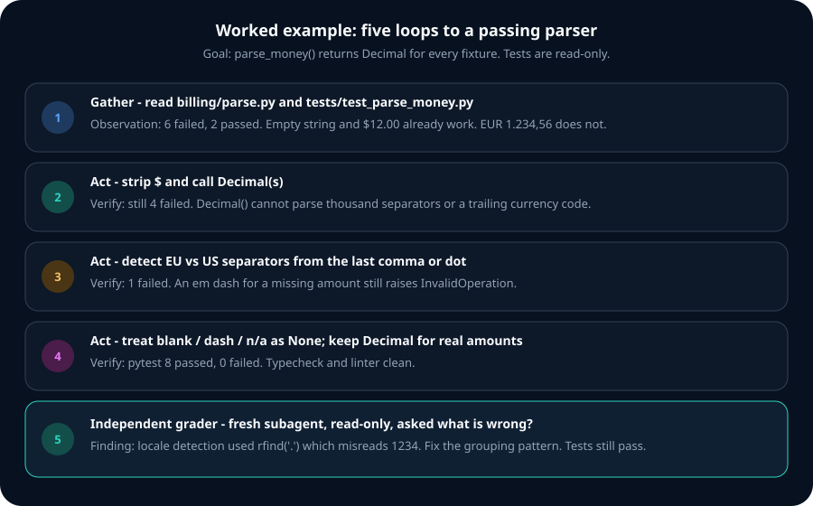
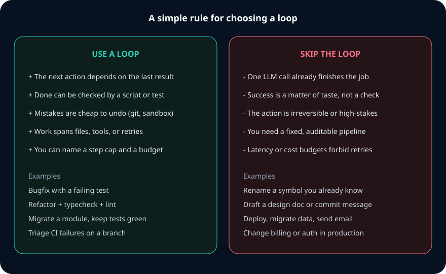

<style>
.diagram-wrap { margin: 1.75rem 0 2.25rem; }
.diagram-wrap img { width: 100%; height: auto; border-radius: 16px; }
.diagram-wrap figcaption { text-align: center; font-size: 0.9rem; opacity: 0.75; margin-top: 0.6rem; }
.callout { border-left: 3px solid #2dd4bf; padding: 0.9rem 1rem; margin: 1.4rem 0; background: color-mix(in srgb, currentColor 6%, transparent); border-radius: 0 10px 10px 0; }
</style>

An **agentic loop** is the control system that turns a language model into an AI coding agent. The model does not answer once and stop. It **gathers context**, **takes an action**, **verifies the result against the world**, and **repeats** until a checkable goal is met — or a hard stop fires.

That loop is why Cursor, Claude Code, Codex, and similar tools can write a function, run the tests, read the failure, patch the code, and run the tests again without you sitting in the middle of every turn. The model still predicts tokens. The loop is what gives those tokens a job, a sensor, and a reason to halt.

This guide is the practical version: what an agentic loop is, how it differs from a chatbot, how to design one that converges, a full coding example, and which jobs should never enter a loop at all.

<div class="callout">

**In one sentence:** an agentic loop is *gather → act → verify → repeat*, with a definition of done that a script can score and a budget that can stop the run.

</div>

<figure class="diagram-wrap">
  
  <figcaption>Figure 1. Anthropic’s working formulation of the agent loop: gather context, take action, verify work, repeat.</figcaption>
</figure>

## What is an agentic loop?

An agentic loop is an iterative execution cycle. An AI agent:

1. Receives a **goal** with a testable success condition.
2. **Gathers** the current state of the world (files, test output, docs, APIs).
3. **Decides** the next action and **executes** it through tools.
4. **Observes** what actually happened.
5. **Verifies** progress against the goal.
6. Either **stops** or **loops** to step 2.

The loop continues until one of these is true: the goal passes an independent check, the agent hits an error it cannot recover from, a step or cost budget is exhausted, a no-progress detector fires, or a human intervenes.

That is different from a prompt. A prompt is one round trip that *you* re-run. A loop is a process: it accumulates evidence, reacts to real tool output, and decides the next move without waiting for your next message.

Boris Cherny, who leads Claude Code at Anthropic, put the shift bluntly: the job is no longer to prompt the model. The job is to **write loops** that prompt the model, score the work, and figure out what to do next.

## How an agentic loop works

Two lineages describe almost every production coding agent you will use in 2026.

### The ReAct pattern

Most loops still look like [ReAct](https://arxiv.org/abs/2210.03629) (Yao et al., 2022): the model interleaves a **thought**, an **action**, and an **observation**.

```
Thought: parse_money() blows up on “€1.234,56” because Decimal() rejects the comma.
Action:  edit billing/parse.py to detect European separators.
Observation: pytest — 3 failed, 5 passed. “1,234.56 USD” still fails.
Thought: US thousands separators are a second case. Handle them next.
```

The load-bearing idea in ReAct is not “the model thinks out loud.” It is that each next thought is **re-conditioned on a real observation**. Chain-of-thought compounds its own guesses. A loop breaks that chain by grounding the next step in tool output — a test log, a file, a compiler error.

On HotpotQA, the original paper reported a hallucination rate of 6% for ReAct versus 56% for chain-of-thought with the same backbone. The mechanism is the same one that makes a coding agent useful: it has to look.

### Gather, act, verify

Anthropic’s [Claude Agent SDK](https://claude.com/blog/building-agents-with-the-claude-agent-sdk) names the phase most teams skip. The cycle is **gather context → take action → verify work → repeat**.

- **Gather** stops the agent from hallucinating state. Before it edits, it reads.
- **Act** is the tool set. Tools are the agent’s personality: a loop that can only write files is weaker than a loop that can search, test, and lint.
- **Verify** stops confident-but-wrong output from compounding. A loop that acts and never checks is a very expensive random walk.
- **Repeat** turns a long horizon into a sequence of short, checkable steps.

A turn inside a harness such as the [Claude Agent SDK loop](https://code.claude.com/docs/en/agent-sdk/agent-loop.md) is one round trip: the model requests tools, the runtime executes them, results feed back, and the cycle continues until the model returns a response with no tool calls — or a cap kills it.

<figure class="diagram-wrap">
  
  <figcaption>Figure 2. In chat, you close the feedback gap. In an agentic loop, the loop does.</figcaption>
</figure>

## Agentic loops vs. a single LLM call

A single-shot call has a hard ceiling. You ask, the model answers, you get the first draft. If it is wrong, *you* notice, *you* describe the failure, *you* ask again. You are the loop.

| | Single-shot LLM call | Agentic loop |
| --- | --- | --- |
| Feedback | None, unless you paste it in | Tool results, tests, compiler, linter |
| State | Stateless per call | Accumulates across turns (or in files) |
| Error recovery | You re-prompt | The agent retries against evidence |
| Cost shape | One inference | N inferences + tool runtime |
| Failure mode | Wrong answer, once | Wrong answer, *repeated*, unless verification is real |
| Best at | Closed questions, drafts, transforms | Multi-step work with observable intermediate state |

Use the table as a routing rule. If the next token does not depend on something the model must *measure*, you do not need a loop.

This is also why agentic loops sit inside [context engineering](/posts/context-engineering-guide/). Each iteration is a bet about what belongs in the window: which files to read, which logs to keep, which failed attempts to summarize, which noise to drop. Anthropic says it directly: the folder and file structure of an agent *is* a form of context engineering. The loop is the process that fills, prunes, and re-grounds that context.

## Why coding agents need loops

Software work is almost never one-shot. The interesting part is the gap between “I think this compiles” and “the suite is green.”

### The code-test-fix cycle

The canonical coding loop is test-driven:

1. Write or patch code.
2. Run the relevant tests.
3. Read the failure, not the story the model tells itself.
4. Patch the cause.
5. Run the tests again.

Without the loop, the agent emits code and stops. With the loop, it can *use the test runner as a sensor*. That is the whole trick.

### Context accumulation across files

A real change spans an interface in file A, a caller in file B, and a fixture in file C. A loop can read, then edit, then re-read. A single prompt has to guess the rest of the repo.

### Error recovery

When `pytest` returns a traceback, a looping agent can treat that traceback as the next spec. A non-looping agent never sees whether its output ran.

## Anatomy of a coding agent loop

Five decisions separate a loop that converges from a loop that bills you for a random walk. Call it the **loop contract**.

<figure class="diagram-wrap">
  
  <figcaption>Figure 3. Fill in all five before you let an agent run unattended.</figcaption>
</figure>

### 1. A checkable definition of done

“Improve the billing parser” is not a goal. This is:

> `pytest tests/test_parse_money.py` exits 0, `test_parse_money.py` is unchanged, and `git diff --name-only` lists only `billing/parse.py`.

Every clause should be something the transcript can show as a command the agent ran. If a human has to squint at the prose to decide whether the loop finished, the loop does not have a definition of done.

### 2. An independent verifier

Agents are optimistic. “Task complete” means the model believes the stop condition was met. It does not mean the work is correct.

The verification ladder, from strongest to weakest:

1. **Deterministic scripts** — tests, typecheckers, linters, build, a pixel diff.
2. **A grader in a fresh context** — a subagent that never saw the chain of thought that produced the patch, asked “what is wrong?” not “does this look good?”
3. **LLM-as-judge in the same conversation** — better than nothing, and still the agent grading its own homework.

<figure class="diagram-wrap">
  
  <figcaption>Figure 4. Maker-grader separation. The reviewer should be read-only and biased toward finding faults.</figcaption>
</figure>

Two practical rules: keep the grader **read-only** so it reports instead of silently “fixing,” and **spawn a new reviewer each round**. A reviewer that already passed round one is biased toward passing round two.

### 3. Layered termination

A single stop condition is not enough. Use layers, and let *any* layer halt the run.

<figure class="diagram-wrap">
  
  <figcaption>Figure 5. Done-check, no-progress, step cap, budget. A loop without a budget is not autonomous — it is a runaway process.</figcaption>
</figure>

Starting points that work for scoped coding tasks:

- **Done-check:** the commands in the goal.
- **No-progress:** same failing tests and a near-identical diff for two rounds.
- **Step cap:** 10–20 turns for a bugfix; 30–50 for a module-sized change.
- **Budget:** a dollar cap and a wall-clock cap. Overnight “just let it run” is usually a sign the goal is underspecified.

### 4. Persistent state

Context windows fill up. Long loops need a place that survives a crash and a compaction: `progress.md`, git commits on green, a failing-test log. Fresh-context patterns such as the Ralph loop (re-spawn the agent on a bash `while` with the same prompt file) only work *because* state lives on disk, not in the chat.

### 5. A human checkpoint before anything irreversible

The loop can drive toward merge-ready. A human still owns merge, deploy, data mutation, and anything that sends a message to the outside world. That single rule prevents the worst-case outcome: an automated change going straight to `main`.

## A worked example: fixing a money parser with an agentic loop

Here is a problem that is a bad one-shot prompt and a good loop. A billing importer must parse amounts from mixed CSVs:

| Raw cell | Expected |
| --- | --- |
| `$12.00` | `Decimal("12.00")` |
| `1,234.56 USD` | `Decimal("1234.56")` |
| `€1.234,56` | `Decimal("1234.56")` |
| `1234` | `Decimal("1234")` |
| `—` | `None` |
| `n/a` | `None` |

A single `Decimal(s)` call fails on separators, currency suffixes, and missing-value glyphs. The next correct edit depends on the last test failure. That is the signature of a loop.

### The goal you hand the loop

```text
Make parse_money() in billing/parse.py satisfy tests/test_parse_money.py.

Definition of done:
- pytest tests/test_parse_money.py exits 0
- tests/test_parse_money.py is not modified
- only billing/parse.py changes

Stop if you hit 12 steps, $3 of model spend, or the same three failures twice.
Work on branch fix/parse-money. Do not merge.
```

### The tests (read-only for the maker)

```python
# tests/test_parse_money.py
from decimal import Decimal
from billing.parse import parse_money

FIXTURES = [
    ("$12.00", Decimal("12.00")),
    ("12.00", Decimal("12.00")),
    ("1,234.56 USD", Decimal("1234.56")),
    ("€1.234,56", Decimal("1234.56")),
    ("12", Decimal("12")),
    ("1234", Decimal("1234")),
    ("", None),
    ("—", None),
    ("n/a", None),
]

def test_parse_money_fixtures():
    for raw, expected in FIXTURES:
        assert parse_money(raw) == expected, raw
```

### What the loop actually did

<figure class="diagram-wrap">
  
  <figcaption>Figure 6. Five iterations. Each observation, not the model’s confidence, chooses the next edit.</figcaption>
</figure>

**Iteration 1 — gather.** The agent reads `billing/parse.py` and the test file. Observation: 6 failed, 2 passed. Empty string and `$12.00` already work.

**Iteration 2 — naive act.** It strips `$` and calls `Decimal(s)`. Observation: 4 still failed. `Decimal` does not understand `1,234.56` or `€1.234,56`.

**Iteration 3 — separator logic.** It uses the last comma or dot to decide EU vs US grouping. Observation: 1 failed. The em dash still raises `InvalidOperation`.

**Iteration 4 — missing values.** It maps `""`, `—`, `n/a` to `None`. Observation: 8 passed, 0 failed. Linter clean.

**Iteration 5 — independent grader.** A *new* read-only subagent, with no memory of those thoughts, is asked “what is wrong?” It finds a leftover bug: treating any last `.` as a decimal mark misreads `"1234"`-like strings that merely contain a grouping-looking character. The maker tightens the pattern. Tests still pass. The loop stops on the done-check, not on the maker saying it is done.

### The code the loop converged on

```python
# billing/parse.py
from __future__ import annotations

from decimal import Decimal, InvalidOperation
import re

_MISSING = {"", "-", "—", "–", "n/a", "na", "none", "null"}
_CURRENCY = re.compile(r"(usd|eur|gbp|€|\$|£)", re.I)
_EU_DECIMAL = re.compile(r"^\d{1,3}(\.\d{3})*,\d+$")
_US_GROUPED = re.compile(r"^\d{1,3}(,\d{3})+(\.\d+)?$")

def parse_money(raw: str | None) -> Decimal | None:
    if raw is None:
        return None
    text = raw.strip()
    if text.lower() in _MISSING:
        return None
    text = _CURRENCY.sub("", text).strip().replace(" ", "")
    if not text:
        return None
    if _EU_DECIMAL.match(text):
        text = text.replace(".", "").replace(",", ".")
    elif _US_GROUPED.match(text):
        text = text.replace(",", "")
    try:
        return Decimal(text)
    except InvalidOperation as exc:
        raise ValueError(f"cannot parse money: {raw!r}") from exc
```

Notice what the loop did *not* need: a perfect first prompt. It needed a fixture list that could say no, tests the agent was forbidden to edit, and a grader that was not the author.

### The control structure, stripped to essentials

You do not have to build this by hand — Claude Code, Cursor, Codex, and the Agent SDK already run a loop. Seeing the skeleton makes the failure modes obvious:

```python
def run_agentic_loop(goal, tools, verifier, plan, *, max_steps=12, budget_usd=3.0):
    context = [goal]
    spent = 0.0
    last_fingerprint = None
    stagnant = 0

    for step in range(1, max_steps + 1):
        thought, action = plan(context)
        observation = tools.execute(action)
        context.append((thought, action, observation))
        spent += cost_of(thought, action, observation)

        verdict = verifier.check(goal, observation)
        if verdict.passed:
            return {"status": "done", "steps": step, "spent": spent}

        fingerprint = verdict.fingerprint
        stagnant = stagnant + 1 if fingerprint == last_fingerprint else 0
        last_fingerprint = fingerprint

        if stagnant >= 2:
            return {"status": "no_progress", "steps": step, "spent": spent}
        if spent >= budget_usd:
            return {"status": "budget", "steps": step, "spent": spent}

    return {"status": "capped", "steps": max_steps, "spent": spent}
```

The model is a subroutine. The loop owns done, money, and boredom.

## When agentic loops work best

Use a loop when **the next action depends on the last observation**, **done is machine-checkable**, and **mistakes are cheap to undo**.

<figure class="diagram-wrap">
  
  <figcaption>Figure 7. If you cannot name a sensor and a stop, you do not have a loop. You have a hope.</figcaption>
</figure>

High-leverage coding use cases:

- **Failing tests as the spec.** Bugfixes, regressions, flaky reproductions you can pin with a fixture.
- **Mechanical migrations with a ratchet.** Rename a module, keep `pytest` and the typechecker green, commit on green.
- **Lint/type debt with a bounded file list.** “Zero new ruff/mypy issues in `billing/`.”
- **CI triage on a branch.** Read the log, patch, re-run the failing job, stop at merge-ready.
- **Greenfield slices with backpressure.** One vertical slice at a time, tests first, iteration cap per slice.
- **Recurring chores with a schedule.** Drain a queue of well-specified issues, summarize CI, refresh docs against a rubric — *if* a verifier can fail the work.

The common shape: a **sensor** (test, compiler, coverage floor, HTTP health check), a **small blast radius**, and a **git safety net**.

## When you should not use an agentic loop

Skip the loop when iteration cannot buy signal, or when a wrong iteration is expensive.

### One-shot work

“Write a Celsius-to-Fahrenheit helper,” “rename this symbol,” “draft the PR summary,” “translate this docstring.” One call. A loop here is latency and cost with no new information between turns.

### Taste, not checks

“Make the API nicer,” “clean up the module,” “write it in a more elegant style.” The agent will thrash. Either add a checkable rubric (public signatures unchanged, benchmark within 2%, coverage not down) or keep a human in every turn.

### Irreversible or high-stakes actions

Do not put these on an unattended loop: production deploys, database migrations, sending email or Slack, refunds and billing, permission and auth changes, force-push, deleting data. The loop may *prepare* the change. A human (or a dedicated gate) submits it.

### Known, deterministic pipelines

If you can write the steps as a script — generate → format → lint → publish to staging — do that. ReAct’s flexibility is wasted compute when the action sequence does not depend on observations. Function calling with a fixed DAG is cheaper, faster, and auditable.

### Tight latency or cost budgets

Every thought/action/observation cycle is at least one model round trip. User-facing autocomplete, request-path classification, and “answer this ticket in 800 ms” are the wrong shape. Run a loop offline; serve the result.

### Brownfield work with no tests and implicit conventions

A loop without backpressure will invent architecture, duplicate utilities, and “fix” tests by deleting them. Add a typechecker at minimum, or keep the human as the verifier.

### When you need bit-for-bit reproducibility

Loops are non-deterministic. Same goal, different file layout, different approach. Compliance, codegen from a spec, and anything that must replay in an audit log want a template or a pipeline, not an unsupervised agent.

<div class="callout">

**Routing heuristic:** if the model could succeed with no tools and no second call, do not use a loop. If a wrong second call can charge a card, ship to prod, or drop a table, do not use an *unattended* loop.

</div>

## Multi-agent loops: when one cycle is not enough

A single loop hits a wall on large diffs and on self-grading. The usual upgrade is not “more steps.” It is **roles with isolated context**:

- **Orchestrator** — splits the goal, assigns work, never edits production files itself.
- **Maker** — implements in a worktree.
- **Grader** — fresh context, read-only, fault-seeking.
- **Optional specialist** — tests-only, docs-only, security-only.

Each sub-agent runs its own gather-act-verify cycle. The parent only sees summaries, which is how you keep the window from turning into a junk drawer.

Do not start here. Start with one loop, a real verifier, and three caps. Reach for orchestration when a single context cannot hold the work — not because a diagram had more boxes.

## Common failure modes (and the fix)

| Failure | What you see | Fix |
| --- | --- | --- |
| Underspecified goal | Scope creep, “improvements” nobody asked for | Write a machine-checkable done-check |
| Self-grading | “Looks good” while tests were never run | Independent verifier; require evidence in the transcript |
| Metric gaming | Tests deleted or skipped to go green | Make test files read-only; fail the loop if they change |
| Hallucinated state | Fixes for APIs that do not exist | Force a gather step; reset if the prompt encoded a fiction |
| Context rot | Repeats a failed approach on turn 20 | Summarize, compact, or re-spawn with state on disk |
| No-progress grind | Token burn, same traceback | Fingerprint failures; stop after two stagnant rounds |
| Runaway cost | A “simple” bug costs $40 | Step cap + dollar cap + cheaper model for mechanical edits |
| Irreversible action | Merge, deploy, or email from the loop | Human checkpoint; deny those tools |

The pattern underneath all of them: **the loop optimized for a proxy**. Give it a better sensor, or stop sending it work.

## Frequently asked questions

### What is an agentic loop in simple terms?

It is a cycle where an AI agent takes an action, sees the real result, and decides the next action — repeating without you typing between steps — until a goal passes a check or a limit stops the run.

### How is an agentic loop different from a chatbot?

A chatbot answers once. You are the feedback. An agentic loop is a process with tools and memory: it reads the world, changes the world, measures the world, and continues. It is closer to a running job than to a search box.

### Is a ReAct loop the same thing as an agentic loop?

ReAct is the most common *inner* pattern (thought → action → observation). “Agentic loop” is the *system*: ReAct plus tools, a verifier, stop conditions, and state. Gather-act-verify is ReAct with the verify stage named so you cannot skip it.

### How many steps should an agentic loop run?

For a scoped bugfix, 10–20 is plenty. For a module-sized change, 30–50. If you need more, the goal is too big — split it. Always pair the cap with a done-check so good work can finish early.

### Can agentic loops run without a human?

Yes, for well-specified, low-stakes, reversible work with a real verifier. Full autonomy should be earned: start attended, then unattended on a branch, then maybe unattended toward merge-ready. Not unattended through merge.

### Why do coding agents get stuck?

Vague goals, missing tools, a verifier the agent can game, and a context window full of its own failed reasoning. Clear done-checks, read-only tests, no-progress detection, and a budget fix most of it.

## Key takeaways

- An **agentic loop** is gather → act → verify → repeat. The loop, not the model, is the unit of agentic coding.
- **Verification** is the load-bearing part. If nothing outside the generator can say “no,” you do not have a loop.
- Write a **five-part contract**: checkable done, independent verifier, layered stops, persistent state, human checkpoint.
- Loops shine when the next edit depends on a test, a compiler, or another sensor, and git can undo a bad turn.
- Skip loops for one-shot tasks, taste-driven work, irreversible actions, and any pipeline you can already script.
- In the money-parser example, five evidenced iterations beat one heroic prompt — because each observation chose the next patch.

The leverage moved. You still need engineering judgment. You spend it on sensors, stop conditions, and the shape of the goal — then you let the loop prompt the model.

<script type="application/ld+json">
{
  "@context": "https://schema.org",
  "@type": "FAQPage",
  "mainEntity": [
    {
      "@type": "Question",
      "name": "What is an agentic loop in simple terms?",
      "acceptedAnswer": {
        "@type": "Answer",
        "text": "An agentic loop is a cycle where an AI agent takes an action, sees the real result, and decides the next action — repeating without a human typing between steps — until a goal passes a check or a limit stops the run."
      }
    },
    {
      "@type": "Question",
      "name": "How is an agentic loop different from a chatbot?",
      "acceptedAnswer": {
        "@type": "Answer",
        "text": "A chatbot answers once and waits. An agentic loop is a process with tools and memory: it reads the world, changes the world, measures the world, and continues until a stopping condition is met."
      }
    },
    {
      "@type": "Question",
      "name": "When should you not use an agentic loop?",
      "acceptedAnswer": {
        "@type": "Answer",
        "text": "Skip agentic loops for one-shot tasks, work judged only by taste, irreversible or high-stakes actions such as deploys and billing, known deterministic pipelines, tight latency budgets, and brownfield code with no tests."
      }
    },
    {
      "@type": "Question",
      "name": "How many steps should an agentic loop run?",
      "acceptedAnswer": {
        "@type": "Answer",
        "text": "For a scoped bugfix, 10 to 20 steps is usually enough. For a module-sized change, 30 to 50 steps may be needed. Pair the cap with a machine-checkable done condition so good work can finish early."
      }
    }
  ]
}
</script>
